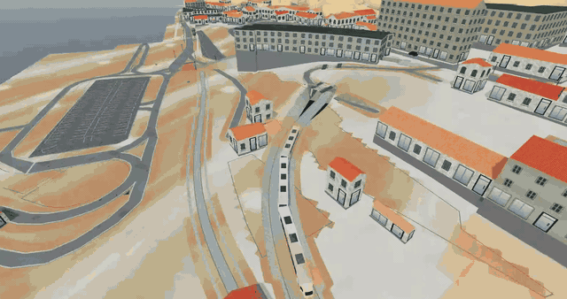
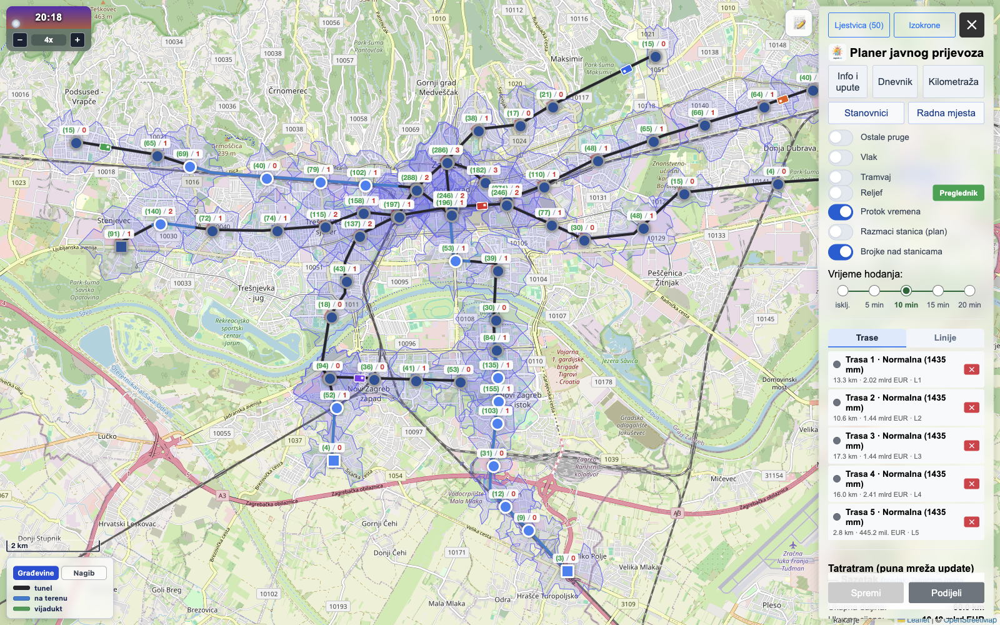
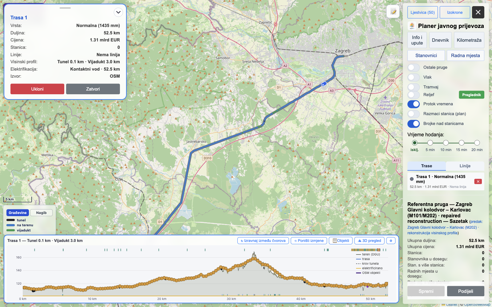
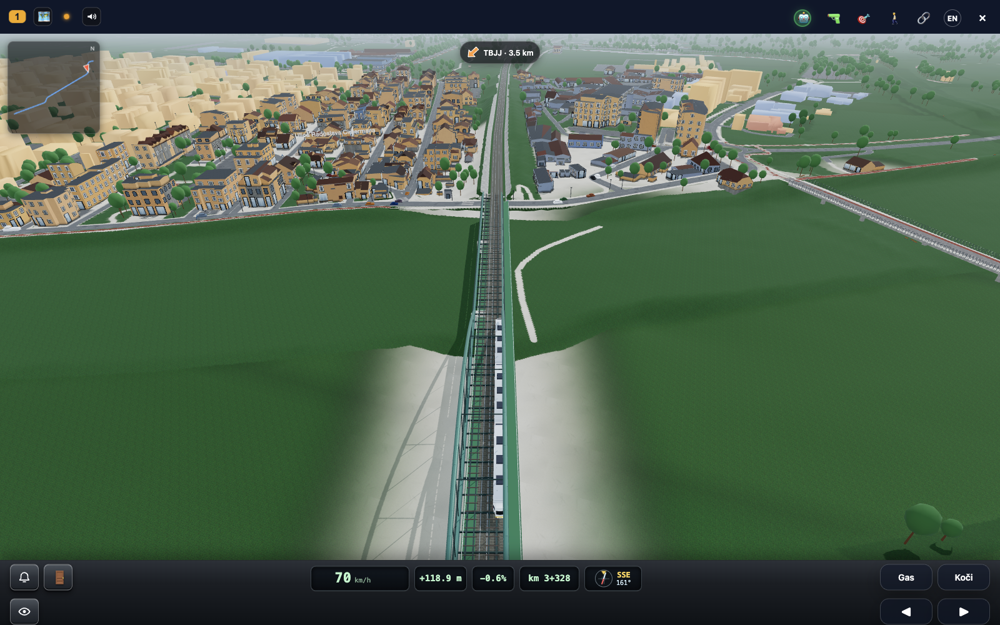
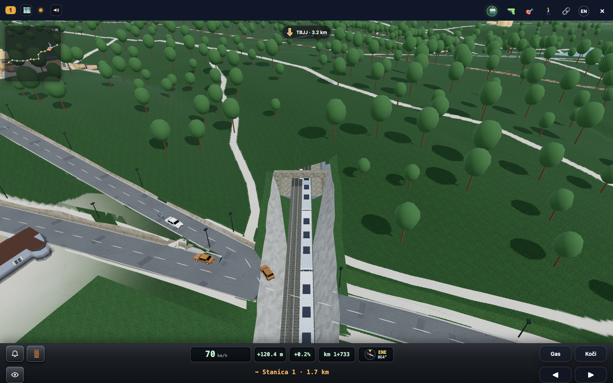

# Universal Transit Planner

Universal Transit Planner is a terrain-aware workspace for designing
public-transport networks, being prepared for an open-source release. Draw
tracks and stations, inspect vertical alignment and civil works, estimate
catchments and costs, compare proposals, and explore the same network in 3D.

It is a **network and infrastructure scenario planner**, not a passenger
journey planner. The map editor is a two-dimensional editing surface backed by
three-dimensional terrain and alignment data.

<p align="center">
  
</p>

<p align="center"><em>A designed line running through Šibenik in the shared Station3D world.</em></p>

## What it does

- edit rail, metro and tram alignments, stations and depots;
- solve terrain-aware grades and identify bridges, tunnels and cuttings;
- estimate construction cost, population and jobs when providers are available;
- calculate walking catchments through a routing provider;
- save, share and compare proposals through an optional persistence provider;
- open the designed network in the independently packaged Station3D engine;
- present the planner in English or Croatian, selected from the URL, a saved
  choice, or the reader's browser language.

Every deployment is selected by a versioned city manifest. Capabilities are
explicit: controls disappear when the selected city has no provider for them,
rather than presenting missing data as zero.

## Screenshots

<table>
  <tr>
    <td width="50%"></td>
    <td width="50%"></td>
  </tr>
  <tr>
    <td><strong>Network map.</strong> Proposed lines, stations and walking catchments.</td>
    <td><strong>Elevation editor.</strong> Chainage, terrain, designed grade, structures and electrification in one profile.</td>
  </tr>
  <tr>
    <td width="50%"></td>
    <td width="50%"></td>
  </tr>
  <tr>
    <td><strong>Elevated railway.</strong> A solved bridge span opened from the planner in Station3D.</td>
    <td><strong>Tunnel approach.</strong> A train descends through a retained cut into a covered section.</td>
  </tr>
</table>

Image provenance and reproducible deep links are in
[docs/images/README.md](docs/images/README.md).

## Status

The project is in pre-release alpha. The map editor, terrain profile workflow,
cost model, proposal comparison and Station3D integration are functional. The
city/provider boundary is now explicit and the portable example has a working
global terrain profile provider, but a turnkey city bootstrap is not ready yet.

The largest remaining pieces are:

- a standalone API and city-scoped project storage;
- generic OSM/Valhalla city bootstrap;
- GTFS and global population/activity adapters;
- portable pricing and vehicle presets;
- finalized regional data provenance and a turnkey deployment guide.

See [docs/extraction-status.md](docs/extraction-status.md) for the working
migration checklist.

## Quick start

Requirements: Node.js 22+. API-backed features additionally require providers
compatible with the selected city manifest. Station3D is installed from its
exact public release tag and needs no sibling checkout.

```sh
git clone https://github.com/Poglavar/universal-transit-planner.git
cd universal-transit-planner
npm ci
npm run dev
```

Open <http://127.0.0.1:8091>. The portable example includes the server-side
Copernicus DEM GLO-30 adapter with automatic GLO-90 fallback. Draw a track to
calculate a preliminary terrain profile. Unsupported controls, including
rendered terrain tiles, remain hidden.

To run the Zagreb compatibility pack explicitly:

```sh
npm run dev:zagreb
```

Create a city pack by copying `config/cities/example.json`, choosing a new
kebab-case ID, and declaring only capabilities backed by real providers. The
build rejects invalid or unsupported capability declarations.

The terrain API can also run independently on port 3001:

```sh
npm run terrain:serve
```

It exposes metadata, coverage, point elevation, route profile and grid
operations under `/api/terrain`. Deployments may set
`window.__TRANSIT_APP_CONFIG__.apiBaseUrl` to a compatible remote API.

## How it fits together

```text
config/cities/       versioned city manifests and provider selection
city-packs/           optional local scripts and datasets, copied only when selected
dist/                 generated runnable build for one selected city
docs/                 architecture and provider contracts
scripts/              manifest validation, deterministic build and dev server
server/terrain/       Copernicus COG provider and reusable HTTP handler
test/                 fast headless contract tests
web/                  map planner, domain modules and host adapters
```

Start with:

- [Architecture](docs/architecture.md)
- [City manifest](docs/city-manifest.md)
- [Provider contracts](docs/provider-contracts.md)
- [Terrain providers](docs/terrain-providers.md)
- [Internationalization](docs/internationalization.md)
- [Contributing](CONTRIBUTING.md)
- [Security policy](SECURITY.md)
- [Third-party notices and data provenance](THIRD_PARTY_NOTICES.md)

Station3D owns reusable terrain, rendering, collision, streaming and world
behavior. This repository owns the planner domain, product UI, provider
selection and city packs.

## License

The project code is available under the [MIT License](LICENSE). Third-party
data and media retain their own terms; provider and screenshot provenance is
documented alongside the relevant assets.
